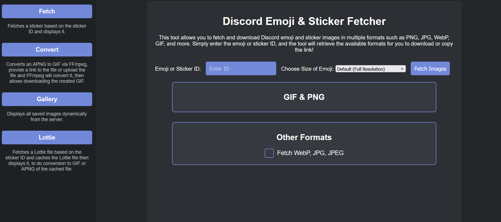

# Discord Sticker & Emoji Extractor

_A look at the home page._

## What It Does

A lightweight, portable web app that allows you to:

* Fetch any Discord sticker or emoji using its ID
* View, convert, and download Discord media in various formats
* Convert stickers (including Lottie and APNG) directly in the browser
* Organize, preview, and manage files in a built-in gallery

---

## Features

### Fetching & Previewing

* **Fetch emojis and stickers by ID** (via Developer Mode in Discord)
* **Optionally choose the output size** for emojis (defaults to full resolution if not specified): 16–512px
* **Smart format detection**: PNG, GIF, WebP, JPG, JPEG
* **Copy CDN links**, preview images, or open them in new tabs

### Conversion Tools

* **PNG ➜ GIF**: Convert static or animated stickers
* **APNG ➜ GIF**: In-browser conversion using WebAssembly FFmpeg
* **Lottie ➜ GIF / APNG**: Stable conversion with custom frame extraction
* **Extract Lottie frames** as PNGs

### File Handling

* **Manual upload** and **URL-based conversion trigger**
* **Download locally** or **save files to the server**
* **Auto-naming system** for server-stored files

### Gallery View

* Built-in gallery to **browse saved images**
* Organized into root and subfolders
* **Interactive preview** and folder-based filtering

### Fully Portable

* Comes with a **self-contained Python 3.7 environment**
* **All required JavaScript libraries included locally**
* Works offline for local file conversions

---

## How to Use

### 1. Download the Program

Download the latest release from the repository.

### 2. Set Up Python

1. Extract the provided Python archive
2. Make sure the folder includes `python/python.exe`
3. You can delete the archive afterwards

### 3. Start the App

Run `start.bat` to launch the local web server.

### 4. Access the Interface

Open [`http://localhost:9000`](http://localhost:9000) in your browser.

### 5. Use the Tools

* **Emoji/Sticker Fetcher**: View & download emoji/sticker in multiple formats
* **APNG to GIF Converter**: Convert local APNG or URL
* **Lottie Viewer**: Load Lottie animation, extract frames, convert to GIF/APNG
* **Gallery**: View, preview and manage saved files

---

## How to Enable Developer Mode in Discord

1. Go to **User Settings** in Discord
2. Navigate to **Advanced** (under "App Settings")
3. Toggle **Developer Mode** to **ON**

With Developer Mode enabled, you can:

* Right-click an emoji or sticker to copy its ID
* Use that ID in this tool to fetch and convert it

---

## Disclaimer

This tool is for educational and personal use only. You are responsible for ensuring you have permission to download and use the media you access. The creator of this tool assumes **no liability** for any misuse or copyright infringement.

---

## Used Libraries & Credits

* [FFmpeg WebAssembly (ffmpeg.wasm)](https://cdn.jsdelivr.net/npm/@ffmpeg/ffmpeg@0.11.6/+esm)
* [Lottie Web](https://cdnjs.cloudflare.com/ajax/libs/lottie-web/5.12.2/lottie.min.js)
* [Lottie Player by LottieFiles](https://unpkg.com/@lottiefiles/lottie-player@latest/dist/lottie-player.js)

---

## License

This project is licensed under the **MIT License**.

---

Enjoy using the **Discord Sticker & Emoji Extractor**!
